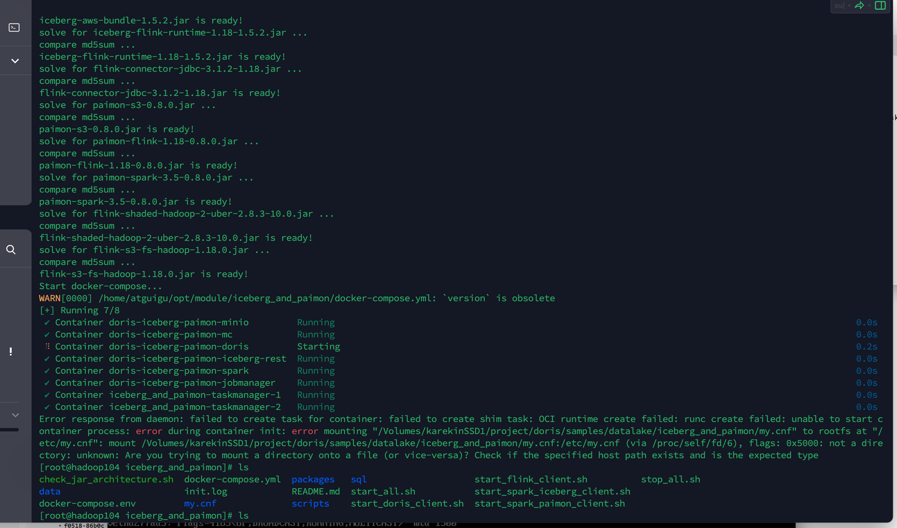
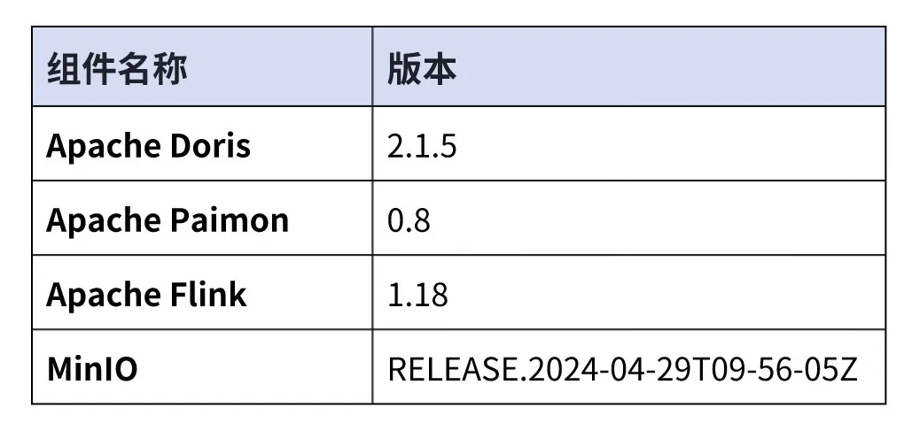
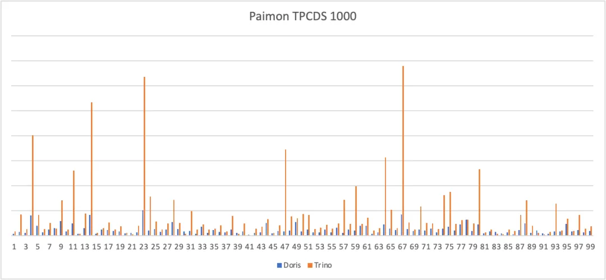
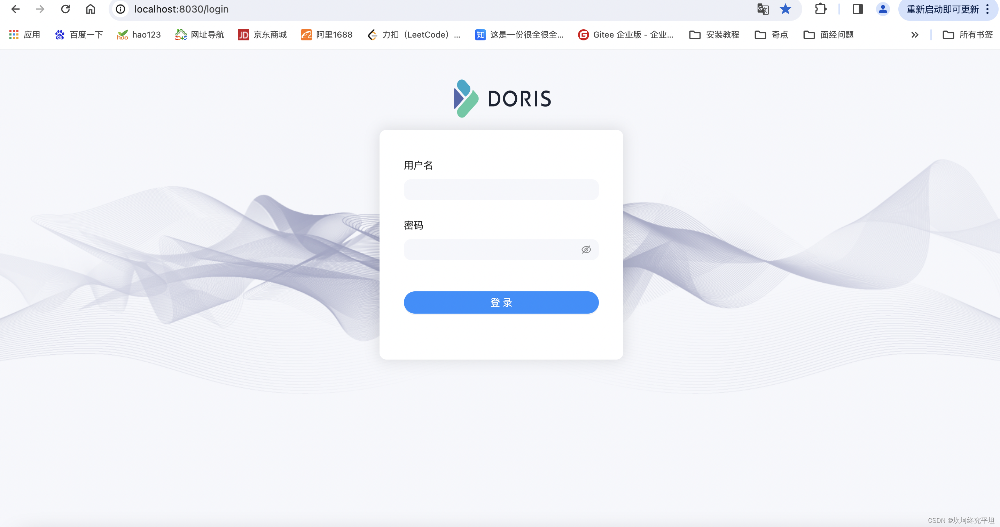
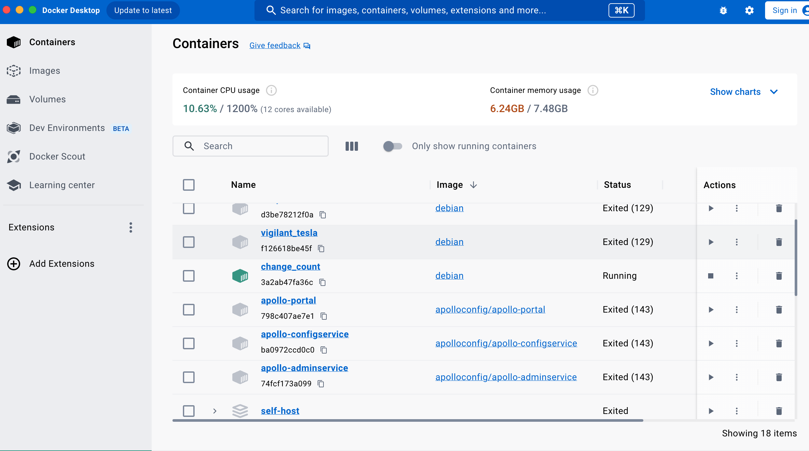
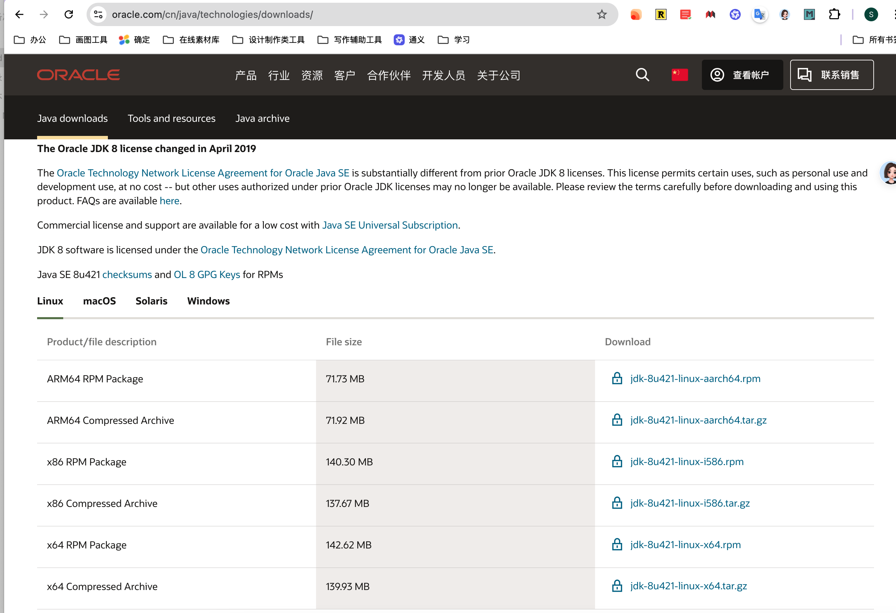

# Apache Doris + Apache Paimon 快速搭建指南｜Lakehouse 使用手册（二）

---

* Apache Doris + Apache Paimon 快速搭建指南｜Lakehouse 使用手册（二） - 微信公众平台
* [https://mp.weixin.qq.com/s/Rb44yaR5bxezIp43lrJK4w](https://mp.weixin.qq.com/s/Rb44yaR5bxezIp43lrJK4w)
* 在 Docker 环境下，如何快速搭建 Apache Doris + Apache Paimon 的测试及演示环境
* 2024-10-08 16:09:38

---

```java
[root@hadoop104 iceberg_and_paimon]# pwd
/home/atguigu/opt/module/iceberg_and_paimon
```

需要提前安装的压缩包：

```java
如果你使用的是基于 Red Hat/CentOS 的轻量级容器（例如用 microdnf 而不是 yum），可以通过 microdnf 安装缺失的包。

1. 安装 net-tools 和 procps 包

你可以使用以下命令来安装缺失的 net-tools（提供 netstat 命令）和 procps（提供 ps 工具集，包括 top, free, kill 等）：

microdnf install net-tools procps

2. 确认安装是否成功

安装成功后，确认 netstat 和 ps 是否可用：

netstat -tuln
ps aux

3. 启动 MySQL 服务

一旦工具安装完成，你可以继续之前的排查步骤，检查 MySQL 的端口绑定和日志信息。
```

‍

‍

​​

‍

> 重要信息置顶：
>
> 1. [doris be arm64架构的官方镜像地址](https://hub.docker.com/r/selectdb/doris.be-ubuntu/tags)   [doris fe arm64架构的官方镜像地址](https://hub.docker.com/r/selectdb/doris.fe-ubuntu/tags)
> 2. [doris SELECTDB 官方论坛](https://ask.selectdb.com/)
> 3. [doris 安装包下载地址](https://github.com/apache/doris/releases/tag/2.1.5-rc02)

‍

‍

湖仓一体（Data Lakehouse）融合了数据仓库的高性能、实时性以及数据湖的低成本、灵活性等优势，帮助用户更加便捷地满足各种数据处理分析的需求。在过去多个版本中，Apache Doris 持续加深与数据湖的融合，已演进出一套成熟的湖仓一体解决方案。

为便于用户快速入门，我们将通过系列文章介绍 Apache Doris 与各类主流数据湖格式及存储系统的湖仓一体架构搭建指南，包括 Hudi、Iceberg、Paimon、OSS、Delta Lake、Kudu、BigQuery 等。目前，我们已经发布了[Apache Doris + Apache Hudi 快速搭建指南｜Lakehouse 使用手册（一）](https://mp.weixin.qq.com/s?__biz=Mzg3Njc2NDAwOA==&mid=2247532020&idx=1&sn=b7f970b106800fa82f1a608a221462e3&chksm=cf2f73f3f858fae5e91620094a2a25c6d3aa865e64922f23efe77bbfaeaf1056b90f77019326&token=894474065&lang=zh_CN&scene=21#wechat_redirect)，通过此文你可了解到在 Docker 环境下，如何快速搭建 Apache Doris + Apache Hudi 的测试及演示环境。本文我们将再续前言，为大家介绍 Lakehouse 使用手册（二）之 Apache Doris + Apache Paimon 搭建指南。

---

Apache Paimon 是一种数据湖格式，并创新性地将数据湖格式和 LSM 结构的优势相结合，成功将高效的实时流更新能力引入数据湖架构中，这使得 Paimon 能够实现数据的高效管理和实时分析，为构建实时湖仓架构提供了强大的支撑。为了充分发挥 Paimon 的能力，提高对 Paimon 数据的查询效率，Apache Doris 对 Paimon 的多项最新特性提供了原生支持：

* 支持 Hive Metastore、FileSystem 等多种类型的 Paimon Catalog。
* 原生支持 Paimon 0.6 版本发布的 Primary Key Table Read Optimized 功能。
* 原生支持 Paimon 0.8 版本发布的 Primary Key Table Deletion Vector 功能。

基于 Apache Doris 的高性能查询引擎和 Apache Paimon 高效的实时流更新能力，用户可以实现：

* **数据实时入湖：** 借助 Paimon 的 LSM-Tree 模型，数据入湖的时效性可以降低到分钟级；同时，Paimon 支持包括聚合、去重、部分列更新在内的多种数据更新能力，使得数据流动更加灵活高效。
* **高性能数据处理分析：** Paimon 所提供的 Append Only Table、Read Optimized、Deletion Vector 等技术，可与 Doris 强大的查询引擎对接，实现湖上数据的快速查询及分析响应。

未来 Apache Doris 将会逐步支持包括 Time Travel、增量数据读取在内的 Apache Paimon 更多高级特性，共同构建统一、高性能、实时的湖仓平台。**本文将会再 Docker 环境中，为读者讲解如何快速搭建 Apache Doris + Apache Paimon 测试 &amp; 演示环境，并展示各功能的使用操作。**

# 一、**使用指南**

---

**本文涉及脚本&amp;代码从该地址获取：**

https://github.com/apache/doris/tree/master/samples/datalake/iceberg\_and\_paimon

**Apache Doris 2.1.5 下载地址：**

https://github.com/apache/doris/releases/tag/2.1.5-rc02

### **01 环境准备**

本文示例采用 Docker Compose 部署，组件及版本号如下：

​​

### **02 环境部署**

1. 启动所有组件

```
bash ./start_all.sh
```

2. 启动后，可以使用如下脚本，登陆 Flink 命令行或 Doris 命令行：

```
bash ./start_flink_client.sh
```

```
bash ./start_doris_client.sh
```

‍

### **03 数据准备**

首先登陆 Flink 命令行后，可以看到一张预构建的表。表中已经包含一些数据，我们可以通过 Flink SQL 进行查看。

```
Flink SQL> use paimon.db_paimon;
[INFO] Execute statement succeed.

Flink SQL> show tables;
+------------+
| table name |
+------------+
|   customer |
+------------+
1 row in set

Flink SQL> show create table customer;
+------------------------------------------------------------------------+
|                                                                 result |
+------------------------------------------------------------------------+
| CREATE TABLE `paimon`.`db_paimon`.`customer` (
  `c_custkey` INT NOT NULL,
  `c_name` VARCHAR(25),
  `c_address` VARCHAR(40),
  `c_nationkey` INT NOT NULL,
  `c_phone` CHAR(15),
  `c_acctbal` DECIMAL(12, 2),
  `c_mktsegment` CHAR(10),
  `c_comment` VARCHAR(117),
  CONSTRAINT `PK_c_custkey_c_nationkey` PRIMARY KEY (`c_custkey`, `c_nationkey`) NOT ENFORCED
) PARTITIONED BY (`c_nationkey`)
WITH (
  'bucket' = '1',
  'path' = 's3://warehouse/wh/db_paimon.db/customer',
  'deletion-vectors.enabled' = 'true'
)
 |
+-------------------------------------------------------------------------+
1 row in set

Flink SQL> desc customer;
+--------------+----------------+-------+-----------------------------+--------+-----------+
|         name |           type |  null |                         key | extras | watermark |
+--------------+----------------+-------+-----------------------------+--------+-----------+
|    c_custkey |            INT | FALSE | PRI(c_custkey, c_nationkey) |        |           |
|       c_name |    VARCHAR(25) |  TRUE |                             |        |           |
|    c_address |    VARCHAR(40) |  TRUE |                             |        |           |
|  c_nationkey |            INT | FALSE | PRI(c_custkey, c_nationkey) |        |           |
|      c_phone |       CHAR(15) |  TRUE |                             |        |           |
|    c_acctbal | DECIMAL(12, 2) |  TRUE |                             |        |           |
| c_mktsegment |       CHAR(10) |  TRUE |                             |        |           |
|    c_comment |   VARCHAR(117) |  TRUE |                             |        |           |
+--------------+----------------+-------+-----------------------------+--------+-----------+
8 rows in set

Flink SQL> select * from customer order by c_custkey limit 4;
+-----------+--------------------+--------------------------------+-------------+-----------------+-----------+--------------+--------------------------------+
| c_custkey |             c_name |                      c_address | c_nationkey |         c_phone | c_acctbal | c_mktsegment |                      c_comment |
+-----------+--------------------+--------------------------------+-------------+-----------------+-----------+--------------+--------------------------------+
|         1 | Customer#000000001 |              IVhzIApeRb ot,c,E |          15 | 25-989-741-2988 |    711.56 |     BUILDING | to the even, regular platel... |
|         2 | Customer#000000002 | XSTf4,NCwDVaWNe6tEgvwfmRchLXak |          13 | 23-768-687-3665 |    121.65 |   AUTOMOBILE | l accounts. blithely ironic... |
|         3 | Customer#000000003 |                   MG9kdTD2WBHm |           1 | 11-719-748-3364 |   7498.12 |   AUTOMOBILE |  deposits eat slyly ironic,... |
|        32 | Customer#000000032 | jD2xZzi UmId,DCtNBLXKj9q0Tl... |          15 | 25-430-914-2194 |   3471.53 |     BUILDING | cial ideas. final, furious ... |
+-----------+--------------------+--------------------------------+-------------+-----------------+-----------+--------------+--------------------------------+
4 rows in set
```

**04 数据查询**

！！！由于简化了docker脚本，所以这里需要手动执行init_doris.sql
如下所示，Doris 集群中已经创建了名为`paimon`​的 Catalog（可通过`SHOW CATALOGS`​查看）。以下为该 Catalog 的创建语句： 

```
-- 已创建，无需执行
CREATE CATALOG `paimon` PROPERTIES (
    "type" = "paimon",
    "warehouse" = "s3://warehouse/wh/",
    "s3.endpoint"="http://minio:9000",
    "s3.access_key"="admin",
    "s3.secret_key"="password",
    "s3.region"="us-east-1"
);
```

你可登录到 Doris 中查询 Paimon 的数据：

```
mysql> use paimon.db_paimon;
Reading table information for completion of table and column names
You can turn off this feature to get a quicker startup with -A

Database changed
mysql> show tables;
+---------------------+
| Tables_in_db_paimon |
+---------------------+
| customer            |
+---------------------+
1 row in set (0.00 sec)

mysql> select * from customer order by c_custkey limit 4;
+-----------+--------------------+---------------------------------------+-------------+-----------------+-----------+--------------+--------------------------------------------------------------------------------------------------------+
| c_custkey | c_name             | c_address                             | c_nationkey | c_phone         | c_acctbal | c_mktsegment | c_comment                                                                                              |
+-----------+--------------------+---------------------------------------+-------------+-----------------+-----------+--------------+--------------------------------------------------------------------------------------------------------+
|         1 | Customer#000000001 | IVhzIApeRb ot,c,E                     |          15 | 25-989-741-2988 |    711.56 | BUILDING     | to the even, regular platelets. regular, ironic epitaphs nag e                                         |
|         2 | Customer#000000002 | XSTf4,NCwDVaWNe6tEgvwfmRchLXak        |          13 | 23-768-687-3665 |    121.65 | AUTOMOBILE   | l accounts. blithely ironic theodolites integrate boldly: caref                                        |
|         3 | Customer#000000003 | MG9kdTD2WBHm                          |           1 | 11-719-748-3364 |   7498.12 | AUTOMOBILE   |  deposits eat slyly ironic, even instructions. express foxes detect slyly. blithely even accounts abov |
|        32 | Customer#000000032 | jD2xZzi UmId,DCtNBLXKj9q0Tlp2iQ6ZcO3J |          15 | 25-430-914-2194 |   3471.53 | BUILDING     | cial ideas. final, furious requests across the e                                                       |
+-----------+--------------------+---------------------------------------+-------------+-----------------+-----------+--------------+--------------------------------------------------------------------------------------------------------+
4 rows in set (1.89 sec)
```

**05 读取增量数据**

我们可以通过 Flink SQL 更新 Paimon 表中的数据：

```
Flink SQL> update customer set c_address='c_address_update' where c_nationkey = 1;
[INFO] Submitting SQL update statement to the cluster...
[INFO] SQL update statement has been successfully submitted to the cluster:
Job ID: ff838b7b778a94396b332b0d93c8f7ac
```

等 Flink SQL 执行完毕后，在 Doris 中可直接查看到最新的数据：

```
mysql> select * from customer where c_nationkey=1 limit 2;
+-----------+--------------------+-----------------+-------------+-----------------+-----------+--------------+--------------------------------------------------------------------------------------------------------+
| c_custkey | c_name             | c_address       | c_nationkey | c_phone         | c_acctbal | c_mktsegment | c_comment                                                                                              |
+-----------+--------------------+-----------------+-------------+-----------------+-----------+--------------+--------------------------------------------------------------------------------------------------------+
|         3 | Customer#000000003 | c_address_update |           1 | 11-719-748-3364 |   7498.12 | AUTOMOBILE   |  deposits eat slyly ironic, even instructions. express foxes detect slyly. blithely even accounts abov |
|       513 | Customer#000000513 | c_address_update |           1 | 11-861-303-6887 |    955.37 | HOUSEHOLD    | press along the quickly regular instructions. regular requests against the carefully ironic s          |
+-----------+--------------------+-----------------+-------------+-----------------+-----------+--------------+--------------------------------------------------------------------------------------------------------+
2 rows in set (0.19 sec)
```

**Benchmark**

---

我们在 Paimon（0.8）版本的 TPCDS 1000 数据集上进行了简单的测试，分别使用了 Apache Doris 2.1.5 版本和 Trino 422 版本，均开启 Primary Key Table Read Optimized 功能。

​​

从测试结果可以看到，**Doris 在标准静态测试集上的平均查询性能是 Trino 的 3 -5 倍**。后续我们将针对 Deletion Vector 进行优化，进一步提升真实业务场景下的查询效率。

# 二、**查询优化**

---

对于基线数据来说，Apache Paimon 在 0.6 版本中引入 Primary Key Table Read Optimized 功能后，使得查询引擎可以直接访问底层的 Parquet/ORC 文件，大幅提升了基线数据的读取效率。对于尚未合并的增量数据（ INSERT、UPDATE 或 DELETE 所产生的数据增量）来说，可以通过 Merge-on-Read 的方式进行读取。此外，Paimon 在 0.8 版本中还引入的 Deletion Vector 功能，能够进一步提升查询引擎对增量数据的读取效率。

Apache Doris 支持通过原生的 Reader 读取 Deletion Vector 并进行 Merge on Read，我们通过 Doris 的 `EXPLAIN`​ 语句，来演示在一个查询中，基线数据和增量数据的查询方式。

```
mysql> explain verbose select * from customer where c_nationkey < 3;
+------------------------------------------------------------------------------------------------------------------------------------------------+
| Explain String(Nereids Planner)                                                                                                                |
+------------------------------------------------------------------------------------------------------------------------------------------------+
| ...............                                                                                                                                |
|                                                                                                                                                |
|   0:VPAIMON_SCAN_NODE(68)                                                                                                                      |
|      table: customer                                                                                                                           |
|      predicates: (c_nationkey[#3] < 3)                                                                                                         |
|      inputSplitNum=4, totalFileSize=238324, scanRanges=4                                                                                       |
|      partition=3/0                                                                                                                             |
|      backends:                                                                                                                                 |
|        10002                                                                                                                                   |
|          s3://warehouse/wh/db_paimon.db/customer/c_nationkey=1/bucket-0/data-15cee5b7-1bd7-42ca-9314-56d92c62c03b-0.orc start: 0 length: 66600 |
|          s3://warehouse/wh/db_paimon.db/customer/c_nationkey=1/bucket-0/data-5d50255a-2215-4010-b976-d5dc656f3444-0.orc start: 0 length: 44501 |
|          s3://warehouse/wh/db_paimon.db/customer/c_nationkey=2/bucket-0/data-e98fb7ef-ec2b-4ad5-a496-713cb9481d56-0.orc start: 0 length: 64059 |
|          s3://warehouse/wh/db_paimon.db/customer/c_nationkey=0/bucket-0/data-431be05d-50fa-401f-9680-d646757d0f95-0.orc start: 0 length: 63164 |
|      cardinality=18751, numNodes=1                                                                                                             |
|      pushdown agg=NONE                                                                                                                         |
|      paimonNativeReadSplits=4/4                                                                                                                |
|      PaimonSplitStats:                                                                                                                         |
|        SplitStat [type=NATIVE, rowCount=1542, rawFileConvertable=true, hasDeletionVector=true]                                                 |
|        SplitStat [type=NATIVE, rowCount=750, rawFileConvertable=true, hasDeletionVector=false]                                                 |
|        SplitStat [type=NATIVE, rowCount=750, rawFileConvertable=true, hasDeletionVector=false]                                                 |
|      tuple ids: 0
| ...............                                                                                                           |                                                                                                  |
+------------------------------------------------------------------------------------------------------------------------------------------------+
67 rows in set (0.23 sec)
```

可以看到，对于刚才通过 Flink SQL 更新的表，包含 4 个分片，并且全部分片都可以通过 Native Reader 进行访问（`paimonNativeReadSplits=4/4`​）。并且第一个分片的`hasDeletionVector`​的属性为`true`​，表示该分片有对应的 Deletion Vector，读取时会根据 Deletion Vector 进行数据过滤。

# 三、**结束语**

---

以上是基于 Apache Doris  与 Apache Paimon 快速搭建测试 / 演示环境的详细指南，后续我们还将陆续推出 Apache Doris 与各类主流数据湖格式及存储系统构建湖仓一体架构的系列指南，包括 Iceberg、OSS、Delta Lake 等，欢迎持续关注。

**系列阅读：**​[Apache Doris + Apache Hudi 快速搭建指南｜Lakehouse 使用手册（一）](http://mp.weixin.qq.com/s?__biz=Mzg3Njc2NDAwOA==&mid=2247532020&idx=1&sn=b7f970b106800fa82f1a608a221462e3&chksm=cf2f73f3f858fae5e91620094a2a25c6d3aa865e64922f23efe77bbfaeaf1056b90f77019326&scene=21#wechat_redirect)

‍

# 四、踩坑经历

首先可以尝试极简安装：[（Mac-arm）Docker极简步骤安装Doris](https://blog.csdn.net/weixin_43498142/article/details/135973203)

## 1. 极简安装

### docker-compese.yml文件编写：

```cobol
version: '3'
services:
  docker-fe:
    image: "apache/doris:1.2.2-fe-arm"
    container_name: "doris-fe"
    hostname: "fe"
    environment:
      - FE_SERVERS=fe1:172.18.0.2:9001
      - FE_ID=1
    ports:
      - 8030:8030
      - 9030:9030
    volumes:
      - ./data/fe/doris-meta:/opt/apache-doris/fe/doris-meta
      - ./data/fe/conf:/opt/apache-doris/fe/conf
      - ./data/fe/log:/opt/apache-doris/fe/log
    networks:
      doris_net:
        ipv4_address: 172.18.0.2
  docker-be:
    image: "apache/doris:1.2.2-be-arm"
    container_name: "doris-be"
    hostname: "be"
    depends_on:
      - docker-fe
    environment:
      - FE_SERVERS=fe1:172.18.0.2:9001
      - BE_ADDR=172.18.0.3:9050
    ports:
      - 8040:8040
    volumes:
      - ./data/be/storage:/opt/apache-doris/be/storage
      - ./data/be/conf:/opt/apache-doris/be/conf
      - ./data/be/script:/docker-entrypoint-initdb.d
      - ./data/be/log:/opt/apache-doris/be/log
    networks:
      doris_net:
        ipv4_address: 172.18.0.3
networks:
  doris_net:
    ipam:
      config:
        - subnet: 172.18.0.0/16
```

### 执行以下命令：

```cobol
启动命令：docker-compose up -d

关闭命令：docker-compose down
```

### 修改 `max_map_count`​

MacOS 由于内部实现容器的方式不同，在部署时宿主机[直接修改](https://so.csdn.net/so/search?q=%E7%9B%B4%E6%8E%A5%E4%BF%AE%E6%94%B9&spm=1001.2101.3001.7020) `max_map_count`​ 值可能无法成功，需要先创建以下容器：

```cobol
docker run -it --privileged --pid=host --name=change_count debian nsenter -t 1 -m -u -n -i sh
```

容器创建成功执行以下命令：

```cobol
sysctl -w vm.max_map_count=2000000
```

如果遇到报错：Please disable swap memory before installation

同样在change_count容器中进行修改（具体原理有机会了解一下，和 windows 非常不同）

```java
swapoff -a
```

### 成功访问：

[http://localhost:8030/ ](http://localhost:8030/ "http://localhost:8030/ ")

账户：admin，密码为空

​
​

注释：不同的mac系统版本（我的是arm)，需要下载不同的镜像，不然启动镜像时会报与当前系统架构不匹配的警告

## 2. 完整安装

## 遇到的卡点

1. mac环境不好修改 `max_map_count`​

    1. 解决办法：参考《极简安装》的修改 max_map_count
    2. 注意事项：需要后台常驻，本质是启动一个change_count容器。目前是每次先删除change_count容器（不删除重复执行第一条命令会报错，不过之后可以直接进入容器，设置max_map_count）

        ​​
2. 系统架构不匹配：示例中的是x86，而我的电脑是mac m2

    1. 在docker- compose.yml文件中，给每个容器新增配置 `platform: linux/arm64`​
    2. 因为某些镜像可能有多个架构的版本，所以需要手动设置platform；
    3. 某些镜像版本可能没有提供arm架构，所以需要筛选
    4. 镜像依赖的安装包也需要改成 linux arm 架构，包括 jdk、doris

        注意是 linux-aarch64.tar.gz

        ​​
3. doris 容器的一些特殊配置：

    * 关闭虚拟内存：DISABLE_SWAP=true
    * ​`bootstrap.system_call_filter=false`​ 这个配置有点忘了？？？
    * command 需要进行一些工具包的预下载，因为需要在容器里执行doris启动脚本，所以要提前分配权限 `chmod +x /opt/scripts/start_doris.sh`​

    ```java
      doris:
        image: mysql:8.0.30
        platform: linux/arm64
        container_name: doris-iceberg-paimon-doris
        networks:
          - demo-iceberg
        hostname: doris
        ports:
          - ${DORIS_QUERY_PORT}:9030
        environment:
          - AWS_ACCESS_KEY_ID=admin
          - AWS_SECRET_ACCESS_KEY=password
          - AWS_REGION=us-east-1
          - LD_LIBRARY_PATH=/opt/doris/be/lib
          - JAVA_HOME=/opt/jdk8
          - bootstrap.system_call_filter=false
          - DISABLE_SWAP=true
        volumes:
          - ./packages/jdk1.8.0_421:/opt/jdk8  # 更新JDK路径
          - ./packages/doris-bin:/opt/doris-bin
          - ./sql/init_doris.sql:/opt/doris-bin/init_doris.sql
          - ./scripts:/opt/scripts
        command: /bin/bash -c "microdnf install util-linux vim procps-ng && chmod +x /opt/scripts/start_doris.sh && /opt/scripts/start_doris.sh"

    ```
4. 完整的 docker-compose.yaml 文件以及 start.sh 脚本如下

‍
