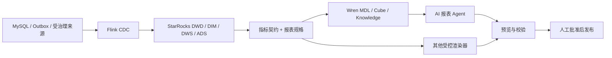

# CloudMold AI 原生报表体系

这套目录把报表从“某个 BI 页面里的配置”提升为可审查、可测试、可被 Agent 消费的工程资产。Wren 是首选 AI 语义与生成层，但不是唯一运行时；指标契约和报表规格才是长期稳定的核心。

## 架构



边界如下：

- StarRocks 负责聚合和可审计事实，报表层不重建业务账。
- `metrics/catalog-v1.json` 定义唯一指标口径、粒度、新鲜度和证据状态。
- `reports/*.json` 定义受治理的布局意图，不保存厂商内部 JSON。
- `wren/` 只暴露必要列，并用 Cube 固化高频聚合；遗漏列对 Agent 不可见。
- `reportctl prompt <report-id>` 是 Agent 的受控输入面；AI 不能自由发明表、指标或维度。
- 正式发布前必须完成租户隔离、只读 SQL、数据新鲜度、截图和人工复核。

## 首批报表

| 报表 | 路线图目标 | 当前证据 | 状态 |
| --- | --- | --- | --- |
| 交易与售后闭环驾驶舱 | 订单、支付、履约、售后三账闭合 | 本地交易 12 行、售后 9 行 | Pilot，非生产 |
| 采购与库存健康看板 | 采购收货、库存余额、仓库与供应商异常 | 本地库存 32 行、采购 1 行 | Pilot，WMS/MES 证据不完整 |
| 数据资产与质量治理看板 | 来源、模型、血缘、DQC、运行门禁 | Metadata 首切片 | Draft，`FIRST_SLICE_PARTIAL` |
| AI 托管治理看板 | AI 观测、分类引用、线索人工复核 | 本地治理聚合面 | Draft，禁止自动执法 |

附件审计后的 `0/719` 是生产来源最终验证口径，不能用上述本地非空样本替代。

上述四套首切片报表已扩展成 8 个多角色经营视图，并在同一个私有工作台中实现：[CloudMold 数据运营中心](https://cloudmold-data-ops.karekin988.chatgpt.site)。跨前端复用的数据产品位于 `useful-scripts/data-products/yshopping-commerce-analytics`，包含 76 个 KPI、8 个角色视图和 24 个本地真实快照指标。当前发布物页面标记为 `LOCAL_TEST`；它不是生产 Live 报表。

## 为什么不是“全押 Wren”

Wren 比传统低代码 BI 更适合 Agent：MDL、Cube、业务规则、记忆和 GenBI 应用都能进入 Git，Agent 可以直接生成或修改应用。但当前 CloudMold 仍保留以下门禁：

1. Wren 官方连接器清单没有 StarRocks；`data_source: mysql` 的语义 SQL 和 Cube 查询已实测通过，但仍是需兼容性门禁的协议路径。
2. GenBI Live、复杂图表、权限、定时发布和运维能力仍需逐项验收。
3. 静态部署不能承载数据库凭证或服务端行级权限。
4. Wren MCP 不直接作为生产公网入口，必须置于认证、审计和只读代理之后。

因此决策是 **Wren-first，而不是 Wren-only**：让 Wren 承担 AI 语义和报表生成；让发布层保持可替换。若 Superset 或其他成熟平台在某阶段更适合 RLS、订阅与运营支持，它只消费相同契约，不重新成为指标真相源。

## 使用

```bash
./scripts/reportctl validate
./scripts/reportctl catalog
./scripts/reportctl prompt commerce-closed-loop
./scripts/reportctl metric-sql inventory.available_quantity --tenant 1
./scripts/lakehousectl report-status

# 在 useful-scripts 根目录
./scripts/commerce-analyticsctl validate
./scripts/commerce-analyticsctl sync-site
```

安装 Wren CLI 后，可在 `analytics/wren` 上继续执行：

```bash
wren context validate --path analytics/wren
wren context build --path analytics/wren
wren memory index
```

当前实测版本是 Wren CLI `0.13.0` 与 `wrenai[mysql]`。Wren MySQL 连接默认启用 SSL；本地未启用 TLS 的 StarRocks 需要在连接 Profile 中设置 `sslMode: DISABLED`，生产必须启用 TLS，不能复制该本地配置。连接凭证只能放在 `~/.wren/profiles.yml` 或环境变量。Pilot 前仍需完成类型映射、时区、`DECIMAL`、`JSON`、布尔值、视图、`CASE`、`COUNT(DISTINCT)`、查询取消、超时和并发限制矩阵。

## 晋级门禁

从 `local_test` 升级到 `pilot`：

- Wren→StarRocks MySQL 协议兼容矩阵全绿；
- 查询服务使用只读账号、固定 ADS/DWS allowlist 和强制租户上下文；
- 报表规格、Cube 与实际结果做黄金样本对账；
- Live 模式通过服务端查询代理，浏览器不持有数据库密钥；
- Agent 只能预览，发布需要人工批准。

从 `pilot` 升级到 `production` 还必须具备生产只读来源、完整分母、持续新鲜度、RLS/权限测试、备份恢复、审计、成本和回滚证据。报表系统不能绕过项目路线图的完成定义。
